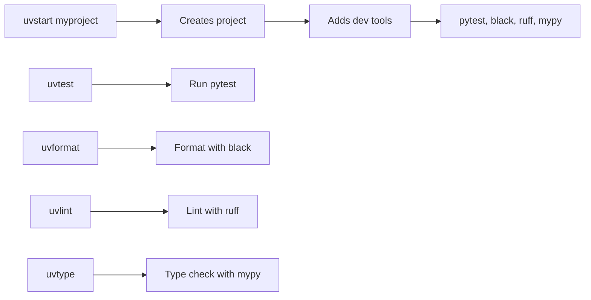
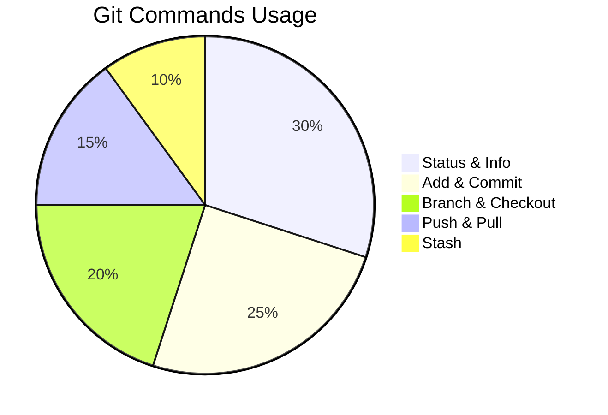
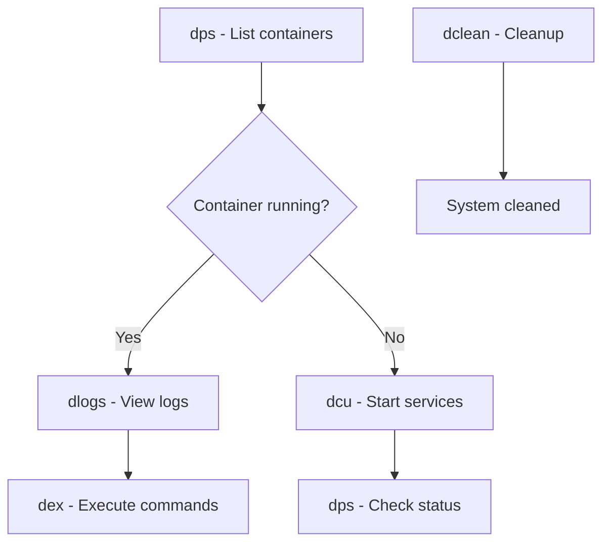
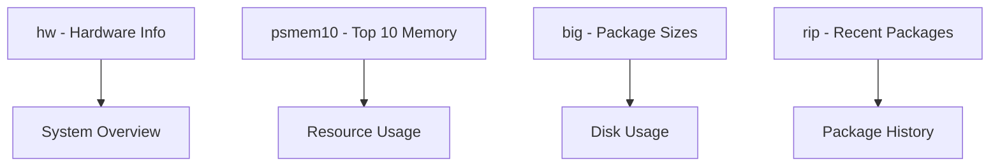
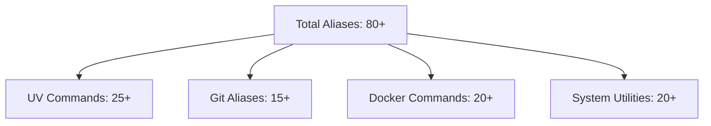

# 🐠 Fish Shell Aliases Cheat Sheet

[](https://fishshell.com/)
[](https://cachyos.org/)
[](https://github.com/astral-sh/uv)
[](https://docker.com/)
[](https://git-scm.com/)

> 🚀 A comprehensive collection of Fish shell aliases for enhanced productivity with UV, Docker, Git, and system utilities.

## 📚 Table of Contents

- [🐍 UV Python Package Manager](#-uv-python-package-manager)
- [🐙 Git Workflow](#-git-workflow)
- [🐳 Docker Commands](#-docker-commands)
- [⚡ General Utilities](#-general-utilities)
- [📁 File Operations](#-file-operations)
- [🔧 System Management](#-system-management)
- [🎯 Quick Setup](#-quick-setup)

---

## 🐍 UV Python Package Manager

> **UV** is a fast Python package and project manager written in Rust.

### 🚀 Project Management

| Alias | Command | Description |
|-------|---------|-------------|
| `uvnew` | `uv init` | Initialize new project |
| `uvrun` | `uv run` | Run command in project context |
| `uvsync` | `uv sync` | Sync project dependencies |
| `uvlock` | `uv lock` | Generate/update lock file |
| `uvcheck` | `uv tree` | Show dependency tree |

### 📦 Package Management

```fish
# Add packages
uvadd requests pandas          # Add multiple packages
uvadd pytest black --dev      # Add dev dependencies
uvdev pytest black ruff       # Add dev dependencies (shortcut)
uvrm package1 package2        # Remove packages
```

### 🔍 Dependency Inspection

| Alias | Command | Description |
|-------|---------|-------------|
| `uvlist` | `uv pip list` | List installed packages |
| `uvshow` | `uv pip show` | Show package details |
| `uvoutdated` | `uv pip list --outdated` | Show outdated packages |
| `uvwhere` | `uv pip show --files` | Show package files location |

### ⚡ Quick Commands



| Alias | Command | Description |
|-------|---------|-------------|
| `uvtest` | `uv run pytest` | Run tests |
| `uvformat` | `uv run black .` | Format code |
| `uvlint` | `uv run ruff check .` | Lint code |
| `uvtype` | `uv run mypy .` | Type check |
| `uvjupyter` | `uv run jupyter lab` | Start Jupyter Lab |
| `uvipython` | `uv run ipython` | Start IPython |

### 🛠️ Environment Management

| Function | Usage | Description |
|----------|-------|-------------|
| `uvenv` | `uvenv [name]` | Create & activate venv |
| `uvactivate` | `uvactivate` | Smart venv activation |
| `uvinfo` | `uvinfo` | Show project information |
| `uvclean` | `uvclean` | Clean cache & temp files |
| `uvhelp` | `uvhelp` | Show UV cheatsheet |

---

## 🐙 Git Workflow

> Streamlined Git commands for faster version control.

### 📊 Git Command Usage



### 🔧 Basic Operations

| Alias | Command | Description |
|-------|---------|-------------|
| `g` | `git` | Git shortcut |
| `gst` | `git status -sb` | Short status |
| `ga` | `git add` | Add files |
| `gad` | `git add .` | Add all files in directory |
| `gaa` | `git add -A` | Add all changes |
| `gap` | `git add -p` | Add patches interactively |

### 💾 Commits

| Alias | Command | Description |
|-------|---------|-------------|
| `gc` | `git commit` | Commit changes |
| `gcm` | `git commit -m` | Commit with message |
| `gca` | `git commit -am` | Add all & commit with message |

### 🌿 Branches

| Alias | Command | Description |
|-------|---------|-------------|
| `gco` | `git checkout` | Checkout branch/commit |
| `gcob` | `git checkout -b` | Create & checkout new branch |
| `gb` | `git branch` | List branches |
| `gba` | `git branch -a` | List all branches |

### 🔍 Inspection

| Alias | Command | Description |
|-------|---------|-------------|
| `gd` | `git diff` | Show differences |
| `gds` | `git diff --staged` | Show staged differences |
| `gl` | `git log --oneline --graph --decorate --all` | Pretty log graph |

### 🔄 Remote Operations

| Alias | Command | Description |
|-------|---------|-------------|
| `gcl` | `git clone` | Clone repository |
| `gp` | `git push` | Push changes |
| `gpl` | `git pull` | Pull changes |
| `gstash` | `git stash push -u` | Stash including untracked |
| `gpop` | `git stash pop` | Pop latest stash |

---

## 🐳 Docker Commands

> Container management made simple.

### 📈 Docker Workflow



### 🐋 Basic Docker

| Alias | Command | Description |
|-------|---------|-------------|
| `d` | `docker` | Docker shortcut |
| `dps` | `docker ps` | List running containers |
| `dpsa` | `docker ps -a` | List all containers |
| `di` | `docker images` | List images |
| `dlogs` | `docker logs -f` | Follow container logs |
| `dex` | `docker exec -it` | Execute interactive command |

### 🛑 Container Control

| Alias | Command | Description |
|-------|---------|-------------|
| `dstop` | `docker stop` | Stop container |
| `drm` | `docker rm` | Remove container |
| `drmi` | `docker rmi` | Remove image |
| `dstopall` | `docker stop $(docker ps -aq)` | Stop all containers |
| `drmall` | `docker rm $(docker ps -aq)` | Remove all containers |

### 🧹 Cleanup

| Alias | Command | Description |
|-------|---------|-------------|
| `dclean` | `docker system prune -af --volumes` | Clean everything |
| `drmi-all` | `docker rmi $(docker images -q)` | Remove all images |

### 🐙 Docker Compose

| Alias | Command | Description |
|-------|---------|-------------|
| `dc` | `docker compose` | Docker Compose shortcut |
| `dcu` | `docker compose up` | Start services |
| `dcud` | `docker compose up -d` | Start services in background |
| `dcd` | `docker compose down` | Stop services |
| `dcb` | `docker compose build` | Build services |
| `dcl` | `docker compose logs` | View logs |
| `dclf` | `docker compose logs -f` | Follow logs |

---

## ⚡ General Utilities

### 🎯 Quick Actions

| Alias | Command | Description |
|-------|---------|-------------|
| `cls` | `clear` | Clear screen |
| `please` | `sudo` | Polite sudo |
| `reload` | `source ~/.config/fish/config.fish` | Reload Fish config |
| `mkd` | `mkdir -p` | Create directories recursively |
| `c` | `clear && fastfetch` | Clear & show system info |

### 🌐 Network & System

| Alias | Command | Description |
|-------|---------|-------------|
| `myip` | `curl ifconfig.me` | Get public IP |
| `weather` | `curl wttr.in` | Get weather |
| `ports` | `ss -tulnp` | Show open ports |
| `path` | `echo $PATH \| tr ":" "\\n"` | Show PATH entries |

### 📝 Editors

| Alias | Command | Description |
|-------|---------|-------------|
| `vi` | `nvim` | Neovim |
| `vim` | `nvim` | Neovim |

### 💤 Power

| Alias | Command | Description |
|-------|---------|-------------|
| `zzz` | `systemctl suspend` | Suspend system |

---

## 📁 File Operations

> **From CachyOS default config**

### 📂 Enhanced Listing (eza)

```fish
# Modern ls replacement with icons and colors
ls='eza -al --color=always --group-directories-first --icons'
la='eza -a --color=always --group-directories-first --icons'
ll='eza -l --color=always --group-directories-first --icons'
lt='eza -aT --color=always --group-directories-first --icons'  # Tree view
l.="eza -a | grep -e '^\.'"  # Show only dotfiles
```

### 🗂️ Navigation

| Alias | Description |
|-------|-------------|
| `..` | Go up one directory |
| `...` | Go up two directories |
| `....` | Go up three directories |
| `.....` | Go up four directories |
| `......` | Go up five directories |

### 📦 Archive Operations

| Alias | Command | Description |
|-------|---------|-------------|
| `tarnow` | `tar -acf` | Create archive |
| `untar` | `tar -zxvf` | Extract archive |

---

## 🔧 System Management

> **CachyOS specific utilities**

### 📊 System Monitoring



### 🏗️ Package Management

| Alias | Command | Description |
|-------|---------|-------------|
| `update` | `sudo cachyos-rate-mirrors && sudo pacman -Syu` | Update system |
| `mirror` | `sudo cachyos-rate-mirrors` | Get fastest mirrors |
| `cleanup` | `sudo pacman -Rns $(pacman -Qtdq)` | Remove orphaned packages |
| `big` | `expac -H M '%m\\t%n' \| sort -h \| nl` | Show packages by size |
| `rip` | `expac --timefmt='%Y-%m-%d %T' '%l\\t%n %v' \| sort \| tail -200 \| nl` | Recent installs |

### 🛠️ System Utilities

| Alias | Command | Description |
|-------|---------|-------------|
| `grubup` | `sudo grub-mkconfig -o /boot/grub/grub.cfg` | Update GRUB |
| `fixpacman` | `sudo rm /var/lib/pacman/db.lck` | Fix pacman lock |
| `hw` | `hwinfo --short` | Hardware information |
| `jctl` | `journalctl -p 3 -xb` | System error messages |

### 📈 Process Monitoring

| Alias | Command | Description |
|-------|---------|-------------|
| `psmem` | `ps auxf \| sort -nr -k 4` | Processes by memory usage |
| `psmem10` | `ps auxf \| sort -nr -k 4 \| head -10` | Top 10 memory consumers |

---

## 🎯 Quick Setup

### 🚀 Getting Started

1. **Copy the configuration** to your Fish config:
   ```fish
   cp your-aliases.fish ~/.config/fish/conf.d/aliases.fish
   ```

2. **Reload Fish configuration**:
   ```fish
   reload  # or source ~/.config/fish/config.fish
   ```

3. **Start using aliases immediately**:
   ```fish
   uvhelp    # Show UV commands
   gst       # Git status
   dps       # Docker containers
   ```

### 💡 Pro Tips

> **🔥 Hot tip**: Use `uvstart myproject` to create a new Python project with all dev tools pre-installed!

> **⚡ Speed tip**: Combine aliases like `gad && gcm "Quick fix" && gp` for rapid commits!

> **🐳 Docker tip**: Use `dclean` regularly to free up disk space from unused containers and images!

### 🆘 Help Commands

| Command | Description |
|---------|-------------|
| `uvhelp` | Show UV package manager help |
| `fishhelp` | Show Fish shell help |
| `git --help` | Git documentation |

---

## 📊 Statistics



---

## 🤝 Contributing

Feel free to suggest improvements or additional aliases! This configuration is designed to be:

- ⚡ **Fast**: Minimal keystrokes for common tasks
- 🧠 **Memorable**: Intuitive naming conventions
- 🔧 **Extensible**: Easy to add new aliases
- 📚 **Documented**: Clear descriptions for all commands

---

## 📄 License

This configuration is free to use and modify. Share it with your fellow developers! 🐠✨

---

<div align="center">

**Made with ❤️ for Fish Shell users**

[](https://fishshell.com/)
[](https://cachyos.org/)

</div>
